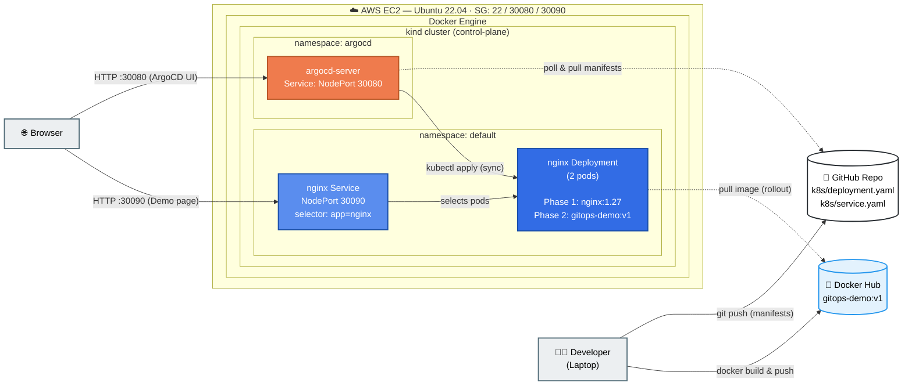

# GitOps Pipeline — Phase 1: EC2 + kind + ArgoCD + GitHub

This guide walks you through setting up a GitOps pipeline on a single EC2 instance using **kind** (Kubernetes in Docker) as the Kubernetes cluster and **ArgoCD** as the GitOps controller. By the end of Phase 1 you will:

- Run a kind Kubernetes cluster on an EC2 instance
- Install ArgoCD inside kind and access its UI from your laptop's browser
- Connect ArgoCD to a public GitHub repo that holds Kubernetes manifests
- Deploy a sample Nginx app via GitOps and open the Nginx welcome page from your laptop

> Phase 2 (later): Build a Docker image from your own app, push it, and let ArgoCD deploy it through the same pipeline.

---

## Architecture



**Legend** — solid arrow = active push/apply · dashed arrow = poll/pull · orange = ArgoCD/AWS · blue = Kubernetes/Docker

**Why this shape?** kind runs Kubernetes nodes as Docker containers. To reach services running inside kind from outside the EC2 box, we use kind's `extraPortMappings` to forward EC2 host ports → kind node ports → Kubernetes NodePort services.

---

## Prerequisites

- AWS account with permission to launch EC2 instances
- A key pair (`.pem` file) for SSH
- A **public** GitHub repo (we'll add manifests to it)
- Your laptop's public IP (for security-group rules) — find it at https://checkip.amazonaws.com

---

## Step 1 — Launch the EC2 Instance

| Field | Value |
|---|---|
| AMI | Ubuntu Server 22.04 LTS (64-bit x86) |
| Instance type | `t3.medium` (2 vCPU, 4 GB RAM) — minimum |
| Storage | 20 GB gp3 |
| Key pair | your existing `.pem` |
| Security group | see below |

### Security Group inbound rules

| Type | Protocol | Port | Source | Purpose |
|---|---|---|---|---|
| SSH | TCP | 22 | My IP | SSH access |
| Custom TCP | TCP | 30080 | My IP | ArgoCD UI |
| Custom TCP | TCP | 30090 | My IP | Nginx app |

> Restrict source to **My IP** for safety. Open to `0.0.0.0/0` only for short demos.

After launch, note the **Public IPv4** address — we'll call it `EC2_PUBLIC_IP`.

### SSH in

```bash
chmod 400 my-key.pem
ssh -i my-key.pem ubuntu@EC2_PUBLIC_IP
```

---

## Step 2 — Install Tools on EC2

Run these on the EC2 instance.

### 2.1 Update + base packages

```bash
sudo apt-get update -y
sudo apt-get install -y curl unzip apt-transport-https ca-certificates gnupg lsb-release
```

### 2.2 Docker (kind needs it)

```bash
curl -fsSL https://get.docker.com | sudo sh
sudo usermod -aG docker ubuntu
newgrp docker          # apply group without re-login
docker version
```

### 2.3 kubectl

```bash
curl -LO "https://dl.k8s.io/release/$(curl -L -s https://dl.k8s.io/release/stable.txt)/bin/linux/amd64/kubectl"
sudo install -o root -g root -m 0755 kubectl /usr/local/bin/kubectl
kubectl version --client
```

### 2.4 AWS CLI v2

```bash
curl "https://awscli.amazonaws.com/awscli-exe-linux-x86_64.zip" -o awscliv2.zip
unzip -q awscliv2.zip
sudo ./aws/install
aws --version
```

### 2.5 Helm

```bash
curl https://raw.githubusercontent.com/helm/helm/main/scripts/get-helm-3 | bash
helm version
```

### 2.6 kind

```bash
curl -Lo kind https://kind.sigs.k8s.io/dl/v0.23.0/kind-linux-amd64
chmod +x kind
sudo mv kind /usr/local/bin/kind
kind version
```

---

## Step 3 — Create the kind Cluster (with port mappings)

The trick to expose services externally on kind is `extraPortMappings`. We'll forward:

- EC2 host **30080** → kind node **30080** (ArgoCD UI)
- EC2 host **30090** → kind node **30090** (Nginx)

Create `kind-config.yaml` on the EC2 instance:

```yaml
kind: Cluster
apiVersion: kind.x-k8s.io/v1alpha4
name: gitops
nodes:
  - role: control-plane
    extraPortMappings:
      - containerPort: 30080
        hostPort: 30080
        listenAddress: "0.0.0.0"
        protocol: TCP
      - containerPort: 30090
        hostPort: 30090
        listenAddress: "0.0.0.0"
        protocol: TCP
```

Create the cluster:

```bash
kind create cluster --config kind-config.yaml
kubectl cluster-info --context kind-gitops
kubectl get nodes
```

You should see one `control-plane` node in `Ready` state.

---

## Step 4 — Install ArgoCD inside kind

### 4.1 Apply the official manifest

```bash
kubectl create namespace argocd
kubectl apply -n argocd -f https://raw.githubusercontent.com/argoproj/argo-cd/stable/manifests/install.yaml
```

Wait for pods to come up:

```bash
kubectl get pods -n argocd -w
```

Press `Ctrl+C` once all pods are `Running`.

### 4.2 Expose `argocd-server` as NodePort 30080

By default `argocd-server` is a `ClusterIP` service. Patch it to NodePort 30080:

```bash
kubectl -n argocd patch svc argocd-server \
  -p '{"spec": {"type": "NodePort", "ports": [{"port": 80, "targetPort": 8080, "nodePort": 30080, "name": "http"}, {"port": 443, "targetPort": 8080, "nodePort": 30443, "name": "https"}]}}'
```

> ArgoCD redirects HTTP → HTTPS by default. To make port 30080 plain HTTP (simpler for a demo), disable TLS on the server:

```bash
kubectl -n argocd patch deploy argocd-server --type json \
  -p '[{"op":"add","path":"/spec/template/spec/containers/0/args/-","value":"--insecure"}]'
kubectl -n argocd rollout status deploy/argocd-server
```

### 4.3 Get the initial admin password

```bash
kubectl -n argocd get secret argocd-initial-admin-secret \
  -o jsonpath="{.data.password}" | base64 -d ; echo
```

### 4.4 Open the UI

In your laptop browser:

```
http://EC2_PUBLIC_IP:30080
```

Log in with:
- **Username:** `admin`
- **Password:** the value from step 4.3

---

## Step 5 — Prepare the GitHub Repo

In your **public** GitHub repo, create a folder `k8s/` with two files.

### `k8s/deployment.yaml`

```yaml
apiVersion: apps/v1
kind: Deployment
metadata:
  name: nginx
  labels:
    app: nginx
spec:
  replicas: 2
  selector:
    matchLabels:
      app: nginx
  template:
    metadata:
      labels:
        app: nginx
    spec:
      containers:
        - name: nginx
          image: nginx:1.27
          ports:
            - containerPort: 80
```

### `k8s/service.yaml`

```yaml
apiVersion: v1
kind: Service
metadata:
  name: nginx
spec:
  type: NodePort
  selector:
    app: nginx
  ports:
    - port: 80
      targetPort: 80
      nodePort: 30090
      protocol: TCP
```

Commit and push. Note your repo URL, e.g. `https://github.com/<you>/<repo>.git`.

---

## Step 6 — Create the ArgoCD Application

An **ArgoCD Application** is the object that connects three things: a **Git repo + folder** (the source of truth), a **target namespace in your cluster** (where to deploy), and a **sync policy** (how often / how aggressively to reconcile). Without it, ArgoCD does nothing — it only manages what you explicitly point it at.

You have two equivalent ways to create it:

- **Option A (recommended for first-timers):** create it through the **ArgoCD UI** — visual, less intimidating
- **Option B (optional, GitOps-purist):** apply a YAML manifest with `kubectl`

Both produce the **exact same object** in the cluster. Pick one.

---

### Option A — Create via the ArgoCD UI

1. Open the ArgoCD UI: `http://EC2_PUBLIC_IP:30080` and log in as `admin`.
2. Click **"+ NEW APP"** (top-left).
3. Fill in the form:

   **GENERAL**
   | Field | Value |
   |---|---|
   | Application Name | `nginx-app` |
   | Project Name | `default` |
   | Sync Policy | `Automatic` |
   | ☑ Prune Resources | checked |
   | ☑ Self Heal | checked |
   | Sync Options → ☑ Auto-Create Namespace | checked |

   **SOURCE**
   | Field | Value |
   |---|---|
   | Repository URL | `https://github.com/<you>/<repo>.git` |
   | Revision | `main` |
   | Path | `k8s` |

   **DESTINATION**
   | Field | Value |
   |---|---|
   | Cluster URL | `https://kubernetes.default.svc` |
   | Namespace | `default` |

4. Click **CREATE** at the top.
5. ArgoCD will immediately fetch the manifests and start syncing. Within ~30 seconds the tile turns green: **Synced** / **Healthy**.

Verify from the EC2 shell:

```bash
kubectl get applications -n argocd
kubectl get pods,svc
```

You should see:
- An `Application` named `nginx-app` showing `Synced` / `Healthy`
- Two `nginx` pods `Running`
- A `nginx` service of type `NodePort` on port 30090

---

### Option B (optional) — Create via YAML manifest

This is the **GitOps-purist** way: the Application object itself lives in Git, so even ArgoCD's configuration is version-controlled. Useful when you want reproducibility — e.g., recreating the cluster from scratch with a single `kubectl apply`.

Create `argocd-app.yaml` on the EC2 instance:

```yaml
apiVersion: argoproj.io/v1alpha1   # ArgoCD's API group
kind: Application                   # The CRD type
metadata:
  name: nginx-app                   # Name shown in ArgoCD UI
  namespace: argocd                 # MUST be argocd (where ArgoCD lives)
spec:
  project: default                  # ArgoCD "project" — default is fine for a POC

  source:                           # WHERE the manifests live
    repoURL: https://github.com/<you>/<repo>.git
    targetRevision: main            # Branch / tag / commit to track
    path: k8s                       # Folder inside the repo to apply

  destination:                      # WHERE to deploy them
    server: https://kubernetes.default.svc   # "this same cluster"
    namespace: default              # K8s namespace to deploy into

  syncPolicy:                       # HOW to keep them in sync
    automated:
      prune: true                   # Delete K8s resources removed from Git
      selfHeal: true                # Revert manual kubectl edits back to Git
    syncOptions:
      - CreateNamespace=true        # Auto-create namespace if missing
```

Apply it:

```bash
kubectl apply -f argocd-app.yaml
```

Watch the sync:

```bash
kubectl get applications -n argocd
kubectl get pods,svc
```

> **UI vs YAML — they are the same object.** If you create the app in the UI, you can later run `kubectl get application nginx-app -n argocd -o yaml` and you'll see almost exactly the manifest above. The UI is just a form that writes this YAML for you.

---

## Step 7 — Open Nginx in Your Browser

```
http://EC2_PUBLIC_IP:30090
```

You should see the **"Welcome to nginx!"** page. That confirms:

GitHub repo → ArgoCD pulled the manifests → kind applied them → kind port-mapped 30090 → EC2 security group allowed it → your browser rendered it.

---

## Step 8 — Test the GitOps Loop

Edit `k8s/deployment.yaml` in GitHub: change `replicas: 2` to `replicas: 3`, commit, push.

Within ~3 minutes (default ArgoCD poll interval) — or instantly if you click **Refresh** in the UI — you'll see a 3rd nginx pod appear:

```bash
kubectl get pods -l app=nginx
```

That is GitOps: **the cluster matches the repo, automatically.**

---

## Troubleshooting

| Symptom | Likely cause | Fix |
|---|---|---|
| Browser hangs on `:30080` | Security group missing the port | Add inbound rule for 30080 |
| `kind create cluster` fails: `permission denied` on docker | User not in `docker` group | `sudo usermod -aG docker ubuntu && newgrp docker` |
| ArgoCD shows `ComparisonError: repository not accessible` | Repo URL typo or repo private | Verify URL; for private repos add credentials in ArgoCD |
| Nginx page loads on EC2 (`curl localhost:30090`) but not from laptop | Firewall / SG | Re-check inbound rule for 30090 |
| `argocd-server` pod stuck in `CrashLoopBackOff` after `--insecure` patch | Patch path wrong | `kubectl -n argocd edit deploy argocd-server` and ensure `--insecure` is in `args:` |
| `t3.medium` runs out of memory | Cluster + ArgoCD is heavy | Use `t3.large` (8 GB) |

---

## Cleanup

```bash
kind delete cluster --name gitops
# Then terminate the EC2 instance from the AWS console
```

---

## Phase 2 — Deploy Your Own Container Image via ArgoCD

In Phase 1, ArgoCD pulled the public `nginx:1.27` image from Docker Hub. In Phase 2 we replace that with a **custom image** that we build ourselves from a `Dockerfile`. Everything else stays the same — same kind cluster, same ArgoCD, same Service on NodePort `30090`. **Only the `image:` field in `deployment.yaml` changes.**

### What we'll do

1. Build a Docker image from the `containerisation/` folder (a colorful animated HTML page served by Nginx)
2. Push the image to **Docker Hub** (free, public)
3. Update `k8s/deployment.yaml` in your GitHub repo to point to your new image
4. ArgoCD detects the Git change and rolls out the new pods automatically

---

### Step 9 — Files in `containerisation/`

```
containerisation/
├── Dockerfile        # Builds an Nginx image with our custom index.html
└── index.html        # Animated GitOps demo page
```

**Dockerfile** (already in this repo):

```dockerfile
FROM nginx:alpine
COPY index.html /usr/share/nginx/html/index.html
EXPOSE 80
```

> Why `nginx:alpine`? It's tiny (~25 MB), and we just need a static-file web server. The `COPY` line replaces Nginx's default welcome page with our own.

The `index.html` is a self-contained page (gradient background, floating rocket, animated badges) that renders the message **"Deployed on Kind K8s Cluster using ArgoCD"**. No external assets — works offline.

---

### Step 10 — Build & Push the Image to Docker Hub

You can run these on your **laptop** *or* on the **EC2 instance** — both have Docker.

```bash
# 1. Log in to Docker Hub (one-time)
docker login
# enter your Docker Hub username + password / access token

# 2. From the project root, build the image
#    Replace <dockerhub-user> with your Docker Hub username
docker build -t <dockerhub-user>/gitops-demo:v1 ./containerisation

# 3. Push it
docker push <dockerhub-user>/gitops-demo:v1
```

Verify on https://hub.docker.com/ — you should see the `gitops-demo` repository with tag `v1`.

> **Tip on tags:** Avoid `:latest` for GitOps. Use explicit versions like `v1`, `v2`, … so ArgoCD has a clear "before vs after" to reconcile.

---

### Step 11 — Update `k8s/deployment.yaml` in GitHub

Open your **GitHub** repo (the same one ArgoCD already watches) and edit `k8s/deployment.yaml`. Change **only** the `image:` line:

```yaml
apiVersion: apps/v1
kind: Deployment
metadata:
  name: nginx              # ← keep the name (so the Service selector still matches)
  labels:
    app: nginx             # ← keep this label too
spec:
  replicas: 2
  selector:
    matchLabels:
      app: nginx
  template:
    metadata:
      labels:
        app: nginx         # ← Service still selects on this label, no change needed
    spec:
      containers:
        - name: nginx
          image: <dockerhub-user>/gitops-demo:v1   # ← THE ONLY CHANGE
          ports:
            - containerPort: 80
```

Commit and push.

> **Why the Service file doesn't need to change:** the `Service` selects pods by the label `app: nginx`. As long as your new Deployment keeps that label and exposes `containerPort: 80`, the existing `nginx` Service on NodePort `30090` automatically routes traffic to your new pods.

---

### Step 12 — Watch ArgoCD Sync

In the ArgoCD UI:
- The `nginx-app` tile turns yellow (**OutOfSync**) within ~3 minutes — or click **REFRESH** for instant detection
- Because we set `automated: { prune: true, selfHeal: true }`, it auto-syncs and turns green again
- A rolling update happens — old pods terminate, new pods come up with your image

Or from the EC2 shell:

```bash
kubectl rollout status deployment/nginx
kubectl get pods -l app=nginx
kubectl describe pod -l app=nginx | grep Image:
```

The `Image:` line should now show `<dockerhub-user>/gitops-demo:v1`.

---

### Step 13 — Open Your Custom Page

Same URL as before:

```
http://EC2_PUBLIC_IP:30090
```

Instead of the plain Nginx welcome page, you should now see your **animated GitOps demo page**.

That confirms the full loop:

`Dockerfile` → `docker build` → Docker Hub → edit `deployment.yaml` in GitHub → ArgoCD syncs → kind rolls out new pods → your browser shows the new page.

---

### Iterating: ship a v2

To prove the GitOps loop end-to-end:

1. Edit `containerisation/index.html` (e.g., change a heading)
2. `docker build -t <dockerhub-user>/gitops-demo:v2 ./containerisation`
3. `docker push <dockerhub-user>/gitops-demo:v2`
4. In GitHub, change the image tag from `:v1` to `:v2`, commit, push
5. ArgoCD detects the change → rolling update → refresh the browser

You never ran `kubectl apply` for any of it. **That is GitOps.**

---

### Troubleshooting (Phase 2)

| Symptom | Likely cause | Fix |
|---|---|---|
| Pods stuck in `ImagePullBackOff` | Image name typo or repo is private | Verify `docker pull <dockerhub-user>/gitops-demo:v1` works from EC2 |
| Page still shows old "Welcome to nginx!" | Browser cache | Hard refresh (`Ctrl+Shift+R`) or check `kubectl describe pod` to confirm image |
| `denied: requested access to the resource is denied` on push | Not logged in | `docker login` again with your Docker Hub credentials |
| ArgoCD doesn't pick up the change | Auto-sync polling delay | Click **REFRESH** in the UI or use **SYNC NOW** |

---


