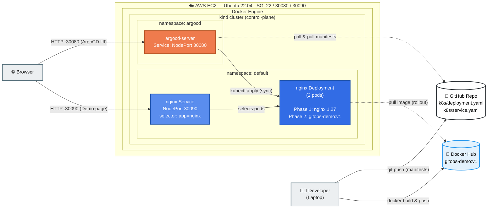
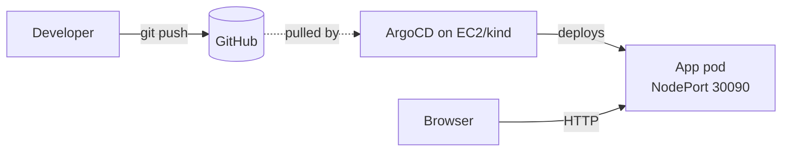

# GitOps Pipeline — Architecture Diagram

## Detailed view (with namespaces and image flow)

---

## Legend

| Style | Meaning |
|---|---|
| Solid arrow `-->` | Active push / apply (someone is doing something now) |
| Dashed arrow `-.->` | Poll / pull (happens on a schedule or on-demand) |
| Orange box | ArgoCD / AWS |
| Blue box | Kubernetes / Docker |
| Light gray | User-facing actor (laptop / browser) |

---

## Simpler one-liner version

For slides or a 30-second explanation:

---

## How to view / export

- **VS Code:** install the *Markdown Preview Mermaid Support* extension, then open this file and `Ctrl+Shift+V` to preview
- **GitHub:** the diagram renders automatically in any `.md` file pushed to a public repo
- **Live editor:** paste the code block into https://mermaid.live to tweak and export PNG / SVG
- **Inside slides:** export as PNG from mermaid.live, or use the *Mermaid* plugin for Notion / Obsidian / Confluence
